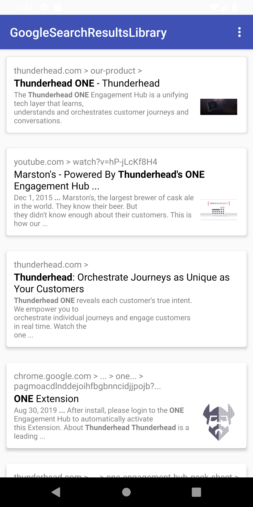
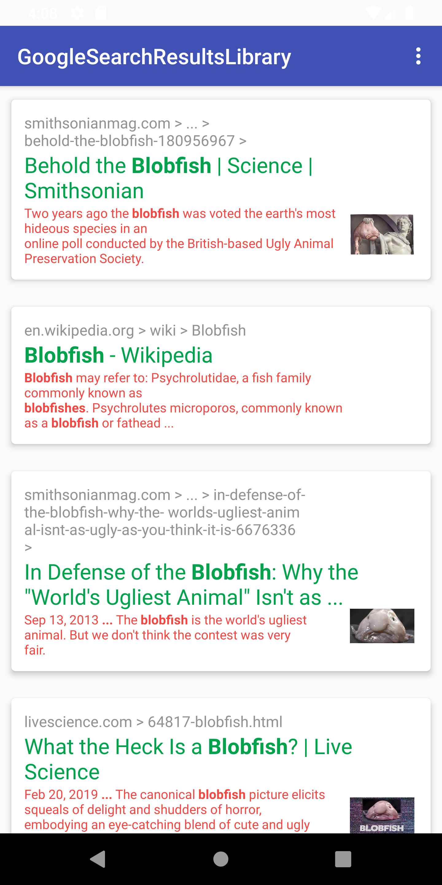
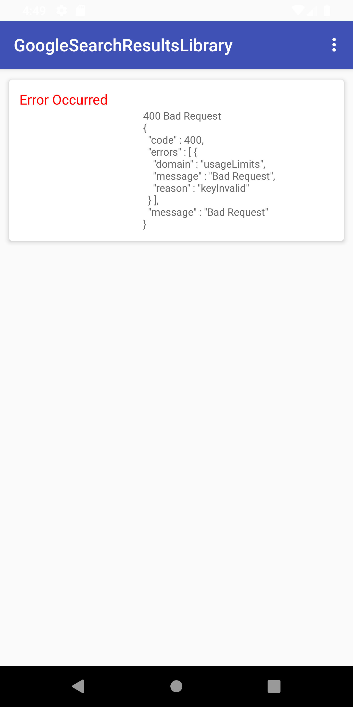

# Google Results View Library

A configurable `RecyclerView`-derived widget that displays a list of Google search results.

<!--  -->
<p align="center">

</p>

## Installation

(If this were a real libaray, it would be) hosted on jcenter, add this to your **build.gradle**:

```gradle
repositories {
      jcenter()
    }

dependencies {
      compile 'zacwolfe.thunderhead.googleresults:googleresults:1.0.0'
    }
```

## Prerequisites

The minimum API level supported by this library is **API 14 (ICE_CREAM_SANDWICH)**.

## Usage

- Add `GoogleResultsView` to your layout file, for example:

```xml
<android.support.design.widget.AppBarLayout>
    ............

    <zacwolfe.thunderhead.googleresults.SearchResultsView
        android:layout_width="match_parent"
        android:layout_height="wrap_content"
        app:maxResults="15"
        app:searchQuery="Thunderhead ONE"/>

</android.support.design.widget.AppBarLayout>
```

- You may also configure the widget with the same attributes during construction in your **Activity**, via a convenient and familiar builder pattern:

```java
SearchResults searchResults = new SearchResults.Builder(this, R.id.searchResultsView)
    .configure()
        .maxResults(15)
        .searchQuery("Thunderhead ONE")
        .end()
    .setGoogleApiKey(GOOGLE_API_KEY)
    .setSearchEngineId(SEARCH_ENGINE_ID)
    .build();
```

- The widget's search capabilities are powered by the [Google Custom Search API](https://developers.google.com/custom-search/docs/overview) and therefore require a valid Google API Key and Search Engine ID, as seen in the above example. A search result consists of a _Link_, _Title_, _Snippet_, and optionally an _Image_. The _Link_ is simply a formatted URL associated with the search result, the _Title_ is just what it sounds like, the _Snippet_ is a short summary describing the content of the referenced page, and the _Image_ is (unsurprisingly) an image pulled from that page, usually corresponding to an `og:image` metadata value.

- A number of text display attributes are configurable. Here's an XML example demonstrating all of them:

```xml
<zacwolfe.thunderhead.googleresults.SearchResultsView
    android:id="@+id/searchResultsView"
    android:layout_width="match_parent"
    android:layout_height="wrap_content"
    android:layout_below="@id/appBar"
    app:cardBackground="@android:color/white"
    app:sizeLinkText="14sp"
    app:colorLinkText="@color/font_lighter_dark_gray"
    app:sizeTitleText="20sp"
    app:colorTitleText="@color/font_green"
    app:sizeSnippetText="12sp"
    app:colorSnippetText="@color/font_red"
    app:maxResults="30"
    app:searchQuery="Blobfish"/>
```

- Of course the same attributes can be set/overridden in code. Here is the result:

<p align="center">

</p>

- You can also respond to press and long-press events by attaching a **ResultsListener** to the widget:

```java
searchResults.setResultListener(new SearchResultListener() {

    @Override
    public void onResultSelected(String url, int position) {

        Log.i(TAG, "Selected " + url);
        launch(url);
    }

    @Override
    public void onResultLongPress(String url, int position) {
        Log.i(TAG, "Long pressed " + url);
    }
});
```

## Sample App

- Included in the project is a sample app that demonstrates the basic features of the app (the above screenshots were captured from it). The relevant files include `MainActivity.java` (the code) and `activity_main.xml` (the layout). The app can be launched from within **Android Studio** by simply running `MainActivity` with either an emulator or physical device attached.

## Error Handling

- As you might expect, as this is merely a demonstration and not meant to be a polished production-ready component, there isn't a huge amount of error handling built in at the moment. However, it was developed with robustness and efficiency in mind, employing best practices such as using `try/catch/finally` where appropriate, proper logging of errors (no `e.printStackTrace()`), not doing unneccessary work on the main thread, etc. The component will attempt to surface search API-related errors to the user, as shown in the following screenshot. **Of course, the associated messaging would need to be further formatted and simplified (showing JSON to the end user is generally not an accepted practice) :-)**:

<p align="center">

</p>

## Notes, TODO and Caveats:

- There is currently no way to trigger a re-query. An obvious feature would be to support a pull-down style refresh action, something that is idiomatic to both Android and iOS

- The dual builder pattern I employed is one I've used several times in the past but may be overkill for such a simple task. However, I think it was useful for separating out those attributes that can be manipulated via XML and those that cannot/should not be (i.e. Google API Key, Search Engine ID).

- The `cardBackground` attribute seems to have some issues on some devices. Namely, although it looked correct on my Pixel 3, it didn't size correctly in the emulator I was using. Unfortunately there doesn't seem to be a reliable/accepted way of setting the background drawable of a `CardView` that will accommodate all situations (e.g. drop shadows, rounded corners, etc.).

- I tried to configure the project to look as much like a typical library/framework as possible, including some gradle configs for publishing to bintray, maven, etc., and even including a license. Of course, I haven't actually tested the deploy functionality and I'd be surprised if it worked in its current state.

## License

> Copyright 2019 Zac Wolfe
>
> Licensed under the Apache License, Version 2.0 (the "License");
> you may not use this file except in compliance with the License.
> You may obtain a copy of the License at

       http://www.apache.org/licenses/LICENSE-2.0

> Unless required by applicable law or agreed to in writing, software
> distributed under the License is distributed on an "AS IS" BASIS,
> WITHOUT WARRANTIES OR CONDITIONS OF ANY KIND, either express or implied.
> See the [License](/LICENSE) for the specific language governing
> permissions and limitations under the License.
